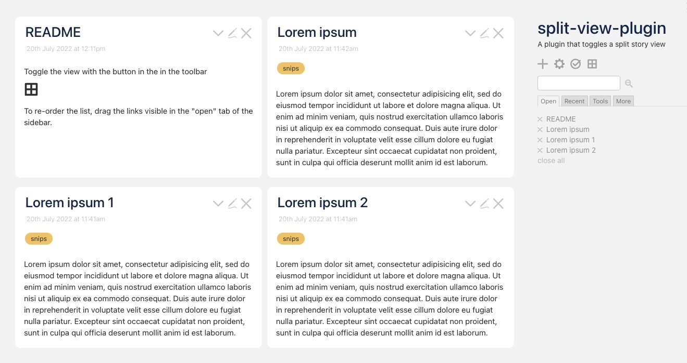

# tiddlywiki-split-view-plugin

A plugin that toggles between single and double column layout for tiddlers. 



## Demo

Try it out at https://tiddlywiki-split-view-plugin.tiddlyhost.com/

## Installing

- The easiest way to install is to view the [demo](https://tiddlywiki-split-view-plugin.tiddlyhost.com/) and drag the plugin into your wiki. 
- To build it yourself then download the source, run `make` and open `index.html`. Then drag the plugin into your wiki.

If running the Server Edition it's best installed at the server end.

- Create a directory `<your-wiki-dir>/plugins/tiddlywiki-split-view-plugin`
- In this directory, copy the content in `src/` from this repository

## Building

```
make install
make
```

Then open `index.html` in your browser.
